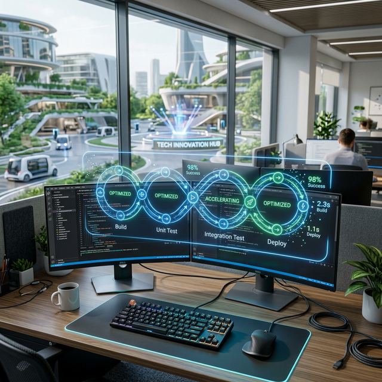

# LinkedIn Post Ideas: AI in DevOps

Creating a high-quality visual for your LinkedIn article is a great way to boost engagement. Since you're discussing the intersection of AI and DevOps, you need an image that represents automation, intelligence, and modern cloud infrastructure.

Here are three distinct visual options and prompts that have been generated for your post!

**Tips for LinkedIn Images**
- **Landscape Ratio:** For LinkedIn articles and feed posts, the standard 16:9 aspect ratio usually works best.
- **Avoid Text in Images:** Unless the generator is exceptionally good, AI text is often garbled. Focus on visual metaphors.
- **Use Good Lighting Keywords:** Words like "cinematic," "soft glow," "volumetric lighting," or "high contrast" significantly improve image quality.
- **Describe the Mood:** Including words like "calm," "focused," "energetic," or "futuristic" helps the AI understand the tone you want.

---

## Option 1: The "AI-Assisted CI/CD" Concept
*Best for a visionary, future-of-tech post.*
This image focuses on the harmony between human intent and AI execution.

**The Prompt:**
> Photorealistic, wide-angle cinematic shot. In the foreground, a modern developer's desk with dual monitors displaying code. A clean, translucent, holographic interface overlays the monitors, glowing with soft blue and green light. This overlay shows an infinite, looping CI/CD pipeline graphic (Build -> Test -> Deploy) being actively optimized and accelerated by an invisible, intelligent system. Gentle light streams in from a window looking out over a futuristic tech campus. The atmosphere is calm, collaborative, and highly advanced. 8k resolution, ultra-detailed.

---

## Option 2: The "Developer’s Companion" Approach
*Best for practical advice about using AI tools.*
This approach is excellent if your article emphasizes specific AI coding assistants (like Copilot or ChatGPT) aiding in daily DevOps tasks.

**The Prompt:**
> Stylized, modern 3D illustration. A determined cloud engineer sits at a massive curved monitor, typing terraform code. Beside them, floating just off the surface of the desk, is a friendly, luminous orb representing an advanced AI co-pilot. The AI orb is projecting a clean holographic flow chart illustrating how to automate the cloud infrastructure deployment the engineer is coding. The background is a gently blurred, high-tech server room with glowing blue LED racks. High contrast, isometric perspective.

---

## Option 3: The Conceptual View (Abstraction)
*Best for complex, technical explanations.*

**The Prompt:**
> A striking, minimal photographic abstraction. A glowing, glowing sapphire blue fractal network representing a complex cloud infrastructure tree. Thousands of small data nodes are connected by pulsing threads of light. A separate, bright emerald-green system of patterns—representing the AI—intercepts the sapphire network, analyzing and reorganizing the nodes into perfectly optimized structures. Dark, matte background to emphasize the glowing elements. Soft lighting, macro-photography detail on the nodes.

